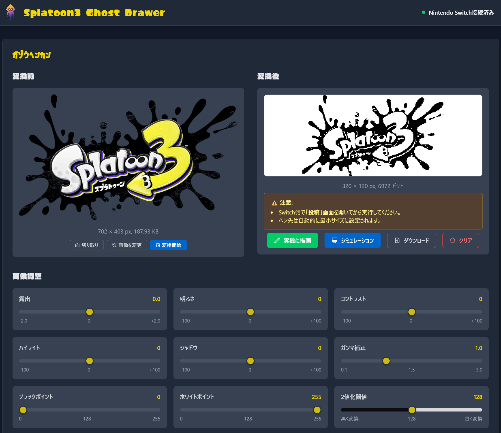
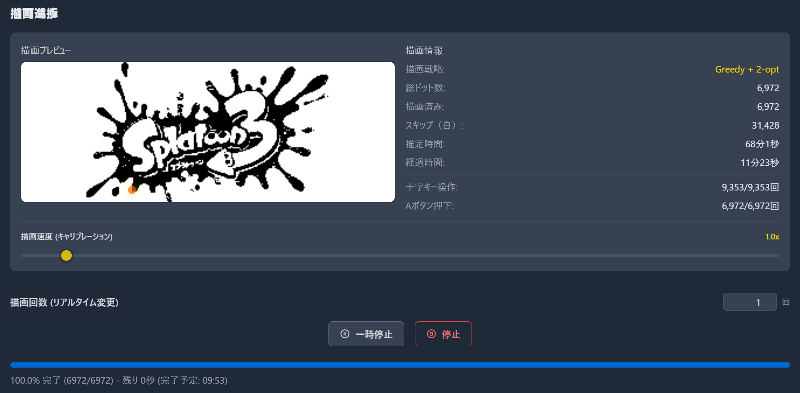

# Splatoon3 Ghost Drawer

Splatoon3の広場で画像を自動描画するシステムです。
Raspberry Pi Zero 2WをUSB経由でNintendo Switchに接続し、Web UIから画像をアップロードするだけで自動的に描画を実行します。

## 主な機能

- 🎨 画像ファイルからSplatoon3用ドットデータへの自動変換
- 🔌 USB経由でのNintendo Switch直接接続
- 🌐 Web UIによる直感的な操作とリアルタイム制御
- 📊 描画進捗のリアルタイム監視とログストリーミング
- 🎯 複数の描画戦略から選択可能（最適化アルゴリズムによる高速描画）
- 📈 描画統計情報の表示

### 描画戦略

| 戦略 | 説明 | パフォーマンス予想 |
|:---|:---|:---|
| **Greedy + 2-opt** | Greedy法と2-opt最適化の組み合わせ | 複雑な描画で高速 |
| **最近傍法** | 最近傍探索で次の描画点を選択 | Greedcy+2-optと比べると低速 |
| **牛耕式 (ジグザグ)** | ジグザグパターンで描画（行ごとに方向反転） | 標準的な速度 |
| **ラスタースキャン** | 左から右、上から下へ順次描画 | 牛耕式 (ジグザグ)と比べると移動時間があるため低速 |

## Web UI 画面イメージ

### 1. 画像変換
画像をアップロードし、2値化の閾値やディザリング設定を調整して、描画用のドットデータに変換します。



### 2. 描画準備
変換された画像を確認し、描画設定（速度など）を調整します。「Paint」ボタンを押すと描画が開始されます。


### 3. 描画進捗
描画中は進捗状況がリアルタイムで表示されます。残り時間や現在の描画位置を確認できます。



## 対応ハードウェア

USB OTG (On-The-Go) 機能をサポートするLinuxボードが必要です：

- **Raspberry Pi Zero 2W**（動作確認済み）

> **注意**: USB OTG対応の他のLinuxデバイスでも動作する可能性がありますが、動作確認は行っていません。

## クイックスタート

### 1. インストール

#### 方法A: リリース版のインストール（推奨）

最新のリリース版は[GitHub Releases](https://github.com/ystk-kai/splatoon3-ghost-drawer/releases)からダウンロードできます。

```bash
# お使いのアーキテクチャに合わせてダウンロード

# Raspberry Pi Zero 2W の場合（ARM64）
wget https://github.com/ystk-kai/splatoon3-ghost-drawer/releases/latest/download/splatoon3-ghost-drawer-Linux-aarch64.tar.gz
tar -xzf splatoon3-ghost-drawer-Linux-aarch64.tar.gz

# WSL2 Ubuntu / 通常のLinux の場合（x86_64）
wget https://github.com/ystk-kai/splatoon3-ghost-drawer/releases/latest/download/splatoon3-ghost-drawer-Linux-x86_64.tar.gz
tar -xzf splatoon3-ghost-drawer-Linux-x86_64.tar.gz

# システムにインストール
sudo cp splatoon3-ghost-drawer-Linux-* /usr/local/bin/splatoon3-ghost-drawer
sudo chmod +x /usr/local/bin/splatoon3-ghost-drawer
```

> **最新のビルド版を使用したい場合**:  
> CI/CDで自動ビルドされた最新版は[GitHub Actions](https://github.com/ystk-kai/splatoon3-ghost-drawer/actions/workflows/build.yml)から「latest-builds」アーティファクトとしてダウンロードできます（GitHubログインが必要）。

#### 方法B: ソースからビルド

```bash
# Rustツールチェーンのインストール（未インストールの場合）
curl --proto '=https' --tlsv1.2 -sSf https://sh.rustup.rs | sh
source ~/.cargo/env

# このプロジェクトをインストール
git clone https://github.com/ystk-kai/splatoon3-ghost-drawer.git
cd splatoon3-ghost-drawer
cargo install --path .

# sudoで実行可能にするための設定
# cargo installでビルドされたバイナリをシステムパスにコピー
sudo cp ~/.cargo/bin/splatoon3-ghost-drawer /usr/local/bin/

# 実行権限を確認
sudo chmod +x /usr/local/bin/splatoon3-ghost-drawer
```

### 2. システムセットアップ（初回のみ）

```bash
# USB Gadgetモードの設定とsystemdサービスの登録
sudo splatoon3-ghost-drawer setup
```

> **注意**: setupコマンドは以下の設定を自動的に行います：
> - USB Gadgetモードの有効化（ブート設定）
> - `splatoon3-gadget.service`（USB Gadget設定サービス）の作成・有効化
> - `splatoon3-ghost-drawer.service`（Web UIサービス）の作成・有効化
> 
> システム再起動後は、両方のサービスが自動的に起動します。

> **注意**: `sudo`実行時のセキュリティ
> - `/usr/local/bin/`にコピーされたバイナリは、sudoコマンドで実行してもPATH内に存在するため直接実行できます
> - `~/.cargo/bin/`内のバイナリはsudo実行時にPATHに含まれないため、フルパスで指定する必要があります
> - システムワイドでの利用には`/usr/local/bin/`へのコピーが推奨されます

### 3. アプリケーションの起動

```bash
# Webサーバーを起動（デフォルト: 0.0.0.0:8080）
splatoon3-ghost-drawer run

# カスタムポートで起動
splatoon3-ghost-drawer run --port 3000

# ローカルホストのみで起動
splatoon3-ghost-drawer run --host 127.0.0.1
```

> **注意**: setupコマンドを実行して再起動後は、Web UIサービスが自動的に起動しているため、手動で`run`コマンドを実行する必要はありません。

### 4. Web UIにアクセス

ブラウザで `http://[デバイスのIPアドレス]:8080` にアクセスして操作を開始します。

## 使用上の注意

### 描画を行う際の手順

1. **Nintendo Switchでポスト投稿画面を開く**
   - 実際のPro Controllerを使用してポスト投稿画面まで移動してください
   - 描画キャンバスが表示されている状態にしてください

2. **実際のコントローラーを置く**
   - ポスト投稿画面を開いたら、実際のPro Controllerは使用しないでください
   - 実際のコントローラーを使用すると、USB Gadget接続が切断されます

3. **Web UIから描画を開始**
   - ブラウザでWeb UIにアクセス
   - 画像をアップロードして「Paint」ボタンをクリック
   - 自動的にUSB Gadget接続が再確立されます

### トラブルシューティング

- **描画が始まらない場合**
  - Raspberry Pi Zero 2WとSwitchの接続を確認してください
  - Web UIをリロードして再度試してください
  
- **途中で描画が止まった場合**
  - 実際のコントローラーを触っていないか確認してください
  - Web UIから再度描画を開始してください

### 接続問題の診断と修正

- **接続状態の診断**
  ```bash
  sudo splatoon3-ghost-drawer diagnose
  ```
  USB Gadget、HIDデバイス、カーネルモジュールの状態を詳しく確認できます。

- **接続の修正**
  ```bash
  sudo splatoon3-ghost-drawer fix-connection
  ```
  カーネルモジュールのロード、USB OTGモードの設定、USB Gadgetのリセット、サービスの再起動を自動的に行います。

- **コントローラーテスト**
  ```bash
  sudo splatoon3-ghost-drawer test
  ```
  実際にボタンやスティックの操作をテストして、接続が正常に動作するか確認します。

## 開発

### 前提条件

- USB OTG対応シングルボードコンピューター（Raspberry Pi Zero 2W推奨）
- 十分な電源供給（5V/2A以上推奨）

### セットアップ

1. **リポジトリのクローン**
```bash
git clone https://github.com/ystk-kai/splatoon3-ghost-drawer.git
cd splatoon3-ghost-drawer
```

2. **依存関係のインストール**
```bash
# Raspberry Pi Zero 2W (Raspberry Pi OS)
sudo apt update
sudo apt install -y build-essential pkg-config libssl-dev
```

3. **Rustのインストール**
```bash
curl --proto '=https' --tlsv1.2 -sSf https://sh.rustup.rs | sh
source ~/.cargo/env
rustup default stable
```

4. **インストール**
```bash
# リリースビルドしてシステムにインストール（推奨）
cargo install --path .
# → ~/.cargo/bin/splatoon3-ghost-drawer にインストールされます
# → PATHが通っているため、どこからでも実行可能

# sudoで実行可能にするための設定
# cargo installでビルドされたバイナリをシステムパスにコピー
sudo cp ~/.cargo/bin/splatoon3-ghost-drawer /usr/local/bin/
# 実行権限を確認
sudo chmod +x /usr/local/bin/splatoon3-ghost-drawer

# または手動でビルドして実行
cargo build --release
# → ./target/release/splatoon3-ghost-drawer を直接実行
# 手動ビルドの場合も同様にコピー可能
sudo cp ./target/release/splatoon3-ghost-drawer /usr/local/bin/
sudo chmod +x /usr/local/bin/splatoon3-ghost-drawer
```

5. **初期セットアップと実行**
```bash
# システムセットアップ（初回のみ、要root権限）
sudo splatoon3-ghost-drawer setup

# アプリケーション起動
splatoon3-ghost-drawer run
```

### 使用方法

#### CLIコマンド

このアプリケーションは5つのコマンドをサポートしています：

##### `setup` - システムセットアップ
```bash
# USB Gadgetモードの設定とsystemdサービスの登録（要root権限）
sudo splatoon3-ghost-drawer setup

# 強制的に再セットアップ（既存の設定を上書き）
sudo splatoon3-ghost-drawer setup --force
```

##### `run` - アプリケーション実行
```bash
# Webサーバーの起動（デフォルト: 0.0.0.0:8080）
splatoon3-ghost-drawer run

# カスタムホストとポートで起動
splatoon3-ghost-drawer run --host 127.0.0.1 --port 3000

# すべてのインターフェースで特定のポートで起動
splatoon3-ghost-drawer run --port 8888
```

##### `cleanup` - システムクリーンアップ
```bash
# setupで作成されたすべての設定を削除（要root権限）
sudo splatoon3-ghost-drawer cleanup
```

##### `info` - システム情報表示
```bash
# 接続状態とシステム情報を表示
splatoon3-ghost-drawer info

# 詳細情報を表示
splatoon3-ghost-drawer info --verbose
```

##### `test` - コントローラーテスト
```bash
# 基本的な接続テスト（要root権限）
sudo splatoon3-ghost-drawer test

# 10秒間のボタンテスト
sudo splatoon3-ghost-drawer test --duration 10 --mode buttons

# スティックテスト
sudo splatoon3-ghost-drawer test --duration 20 --mode sticks

# 利用可能なモード:
# - basic: 基本動作テスト（Aボタンとスティック操作）
# - buttons: 全ボタンの順次テスト
# - sticks: アナログスティックの動作テスト
# - interactive: インタラクティブモード（未実装）
```

##### ヘルプとバージョン
```bash
# ヘルプの表示
splatoon3-ghost-drawer --help
splatoon3-ghost-drawer <command> --help

# バージョンの表示
splatoon3-ghost-drawer --version
```

#### Web UIの使用

1. `splatoon3-ghost-drawer run` でサーバーを起動
2. ブラウザで `http://[IPアドレス]:8080` にアクセス
3. 画像をアップロードして変換・描画を実行

## アーキテクチャ

詳細なアーキテクチャ設計については [docs/architecture.md](docs/architecture.md) を参照してください。

### 主要コンポーネント

- **Domain Layer**: アートワーク、コントローラー、ペインティングのドメインロジック
- **Application Layer**: ユースケースとアプリケーションサービス
- **Infrastructure Layer**: ハードウェア抽象化、USB OTG制御、画像処理
- **Interface Layer**: CLI、Web UI、イベントハンドリング

## 制限事項

1. **ハードウェア制約**: USB OTG対応ボードが必要
2. **性能制約**: Raspberry Pi Zero 2Wはメモリ制限により大きな画像処理に時間がかかる場合があります
3. **互換性**: Nintendo Switch本体のファームウェアバージョンによる制約
4. **法的制約**: 自動化ツールの使用は利用規約を確認してください

## トラブルシューティング

### USB OTG が認識されない

```bash
# USB Gadgetの状態確認
sudo systemctl status splatoon3-gadget.service

# カーネルモジュールの確認
lsmod | grep -E "dwc2|libcomposite"

# 手動でUSB Gadgetを設定（通常はsystemdが自動実行）
sudo splatoon3-ghost-drawer _internal_configure_gadget
```

### Web UIにアクセスできない

```bash
# サーバーが起動しているか確認
ps aux | grep splatoon3-ghost-drawer

# ポートが開いているか確認
sudo lsof -i :8080

# ファイアウォールの確認
sudo iptables -L -n | grep 8080
```

### Nintendo Switchで認識されない

```bash
# HIDデバイスの確認
ls /dev/hidg*

# USB Gadgetの状態確認
cat /sys/kernel/config/usb_gadget/g1/UDC

# dmesgでUSB関連のログを確認
dmesg | tail -50 | grep -i usb
```
